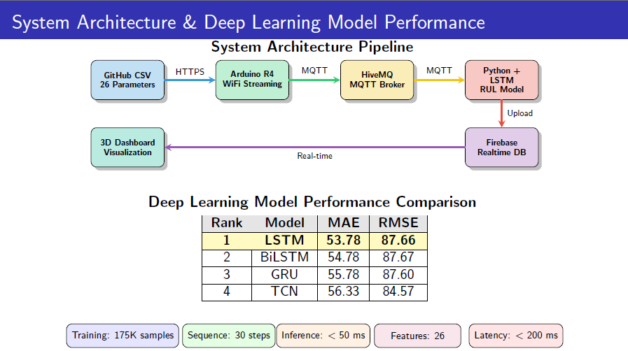

# 🔋 Digital Twin for EV Battery Health & Predictive Maintenance

[](https://opensource.org/licenses/MIT)
[](https://www.python.org/)
[](https://streamlit.io/)
[](https://mqtt.org/)
[](https://firebase.google.com/)

A comprehensive **Digital Twin–based predictive maintenance system** for Electric Vehicle (EV) batteries that integrates IoT sensors, cloud infrastructure, and AI/ML models. This project provides real-time monitoring, predictive analytics, and 3D visualization of battery health status.


*System architecture showing end-to-end data flow from sensors to visualization*

## 🎥 Demo

[](https://youtu.be/z4uThEmmh6w)

[Click here to watch the full demo on YouTube](https://youtu.be/z4uThEmmh6w)

## 🎯 Project Overview

This system monitors real-time battery health metrics, predicts degradation patterns, and provides actionable maintenance insights to:
- **Extend battery lifespan** through proactive maintenance
- **Prevent unexpected failures** with early warning systems
- **Optimize EV operations** using data-driven decisions
- **Enable real-time monitoring** with 3D visualization

## ✨ Key Features

### 🔌 Real-time Monitoring
- **3D Battery Visualization** - Interactive 3D model showing battery health status
- **Live Metrics** - Real-time monitoring of voltage, temperature, SoC, and SoH
- **Vehicle Simulation** - 3D models of EV and e-bike with dynamic status updates

### 🤖 AI/ML Predictive Models
- **LSTM Networks** for Remaining Useful Life (RUL) prediction
- **Health Status Classification** - Categorizes battery health (Excellent, Good, Fair, Poor, Critical)
- **Anomaly Detection** - Identifies abnormal battery behavior patterns

### 📊 Interactive Dashboard
- **Real-time Gauges** - Visual representation of key metrics
- **Historical Trends** - Time-series analysis of battery parameters
- **Predictive Analytics** - Forecasts battery degradation and maintenance needs

### ☁️ Cloud Integration
- **Firebase Realtime Database** - Secure and scalable data storage
- **RESTful API** - For data retrieval and system control
- **User Authentication** - Secure access control for different user roles

## 🚀 Tech Stack

### Backend
- **Python 3.8+** - Core programming language
- **TensorFlow/Keras** - Deep learning models for RUL prediction
- **Scikit-learn** - Machine learning algorithms
- **Firebase Admin SDK** - Real-time database integration

### Frontend
- **Streamlit** - Interactive web dashboard
- **Plotly** - Interactive data visualization
- **3D Visualization** - Custom 3D models for battery and vehicles

### IoT & Connectivity
- **MQTT** - Lightweight messaging protocol for IoT devices
- **ESP32** - Microcontroller for sensor data collection
- **REST API** - For system integration

### DevOps
- **Git** - Version control
- **Docker** - Containerization
- **GitHub Actions** - CI/CD pipeline

## 🛠️ Installation

1. **Clone the repository**
   ```bash
   git clone https://github.com/Shree2604/DigitalTwin-EVBattery.git
   cd DigitalTwin-EVBattery
   ```

2. **Set up a virtual environment**
   ```bash
   python -m venv venv
   source venv/bin/activate  # On Windows: .\venv\Scripts\activate
   ```

3. **Install dependencies**
   ```bash
   cd Streamlit
   pip install -r requirements.txt
   ```

4. **Configure Firebase**
   - Create a Firebase project and download the service account JSON file
   - Place the JSON file in the `Streamlit` directory as `digitaltwin-evbattery-firebase-adminsdk-fbsvc-c087b8aebb.json`

5. **Run the application**
   ```bash
   streamlit run streamlit_3d_dashboard.py
   ```

## 📊 Features in Detail

### 3D Battery Health Visualization
- Interactive 3D model showing real-time battery status
- Color-coded health indicators (Green to Red)
- Dynamic updates based on live sensor data

### Vehicle Simulation
- 3D models of EV car and e-bike
- Real-time status updates
- Animated components based on sensor data

### Analytics Dashboard
- Real-time gauges for key metrics
- Historical data visualization
- Predictive maintenance alerts

## 📈 Data Flow

1. **Data Collection**: ESP32 devices collect sensor data (voltage, temperature, etc.)
2. **Data Transmission**: MQTT protocol sends data to Firebase in real-time
3. **Data Processing**: Python backend processes and analyzes the data
4. **Prediction**: ML models predict battery health and RUL
5. **Visualization**: Streamlit dashboard displays real-time 3D visualization and analytics

## 🤝 Contributing

Contributions are welcome! Please follow these steps:

1. Fork the repository
2. Create a feature branch (`git checkout -b feature/AmazingFeature`)
3. Commit your changes (`git commit -m 'Add AmazingFeature'`)
4. Push to the branch (`git push origin feature/AmazingFeature`)
5. Open a Pull Request

## 📄 License

This project is licensed under the MIT License - see the [LICENSE](LICENSE) file for details.

## 📧 Contact

For questions or collaboration opportunities:

- **Email**: shree.xai.dev@gmail.com
- **LinkedIn**: [Shreeraj Mummidivarapu](https://linkedin.com/in/m-shreeraj)
- **Project Link**: [https://github.com/Shree2604/DigitalTwin-EVBattery](https://github.com/Shree2604/DigitalTwin-EVBattery)

## 🙏 Acknowledgments

- Built with ❤️ for a sustainable EV future
- Special thanks to the open-source community for their valuable contributions

<div align="center">

**⭐ Star this repository if you find it helpful!**

Made with ❤️ for a sustainable EV future

</div>
